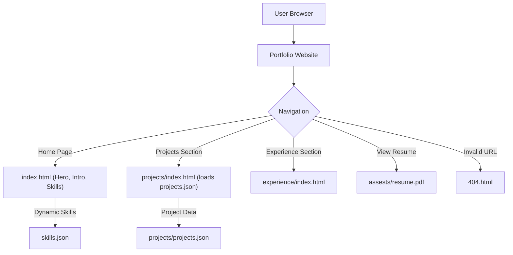

# 🚀 Portfolio Website

<p align="center"></p>

## Short Description
Unleash your professional story with this dynamic and highly customizable personal portfolio website! Designed for developers, designers, and creatives, this project provides a modern, responsive, and interactive platform to showcase your skills, experience, and projects to the world. Built with clean HTML, CSS, and JavaScript, it emphasizes performance, visual appeal, and ease of deployment.

## ✨ Key Features
*   **Immersive Home Page:** Captivating hero sections and interactive elements (like `particles.min.js`) create an engaging first impression.
*   **Dynamic Project Showcase:** Easily add and manage your projects via `projects/projects.json`, with dedicated pages for detailed views.
*   **Comprehensive Skill Matrix:** Highlight your technical proficiencies using `skills.json` for a clear overview of your capabilities.
*   **Detailed Experience Timeline:** A dedicated section (`experience/index.html`) to outline your professional journey and achievements.
*   **Accessible Resume:** Direct linking to your resume (`assests/resume.pdf`) for quick review by potential employers.
*   **Robust CI/CD Pipeline:** Automated deployment and testing configured via `.github/workflows/ci-cd.yml` ensures continuous delivery.
*   **Custom 404 Page:** A stylish and user-friendly error page to guide visitors back to relevant content.
*   **Responsive & Modern Design:** Crafted with modern CSS (`assests/css/style.css`) for a seamless experience across all devices.

## Who is this for?
This portfolio is ideal for:
*   **Software Developers:** Showcase your coding projects and technical expertise.
*   **Web Designers:** Present your design work and front-end capabilities.
*   **Freelancers:** Attract new clients by clearly demonstrating your portfolio and skills.
*   **Students & Job Seekers:** Create a compelling online presence for recruiters and hiring managers.
*   Anyone looking to establish a professional digital footprint with a powerful and elegant website.

## Technology Stack & Architecture
This project is built as a highly performant static website, leveraging core web technologies for maximum compatibility and speed.

*   **Frontend:** HTML5, CSS3, JavaScript (Vanilla JS, with `particles.js` for visual effects).
*   **Data Management:** JSON files (`projects/projects.json`, `skills.json`) for dynamic content loading, simplifying updates without database interaction.
*   **Deployment:** Configured for Continuous Integration/Continuous Deployment (CI/CD) using GitHub Actions.

## 📊 Architecture & Database Schema
Given this is a static, client-side portfolio, there isn't a traditional backend database. Instead, content is driven by local JSON files. The architecture focuses on the user's journey through the site:



## ⚡ Quick Start Guide
To get your own version of this impressive portfolio up and running, follow these simple steps:

1.  **Clone the Repository:**
    ```bash
    git clone https://github.com/tarundhullur/portfolio_website.git
    cd portfolio_website
    ```

2.  **Open in Browser:**
    Simply open the `index.html` file in your preferred web browser. All content is served directly from the local files.
    ```bash
    # For Linux/macOS
    open index.html
    # For Windows
    start index.html
    ```

3.  **Customize Your Content:**
    *   Edit `index.html` to personalize your introductory text and sections.
    *   Update `projects/projects.json` with details of your own work.
    *   Modify `skills.json` to reflect your unique skill set.
    *   Replace `assests/resume.pdf` with your current resume.
    *   Change images in `assests/images/` to match your branding.

## 📜 License
This project is licensed under the MIT License. See the `LICENSE` file for more details.